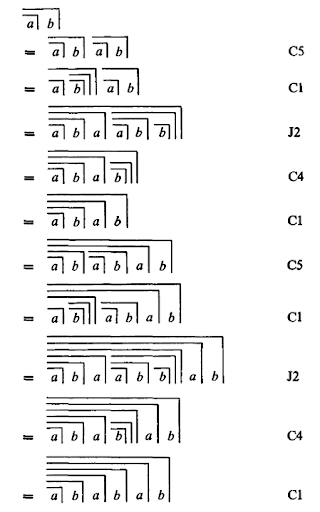
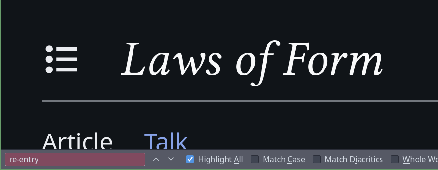
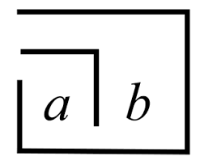

PYLOF
==================================================

> !IN DEVELOPMENT!

Command line tool to create visual representations of the symbolic notations of the *Calculus of Indication* in the *Laws of Form (LoF)* by George Spencer Brown.[^1]

- [Requirements](#requirements)
- [Syntax](#markup-syntax)
- [Parser](#parser)
    - [Unicode Parser](#unicode-parser)
- [License](#license)
- [Statement](#the-generative-predicament)

# Requirements
- Python (3.13.7)
- Lua (5.4.8)
    - prenlight (1.14.0-3)

# Markup Syntax
*Pylof* uses [kMark](https://github.com/bertrandterrier/kmark) as basic prompting syntax.

# Cheat Sheet

# License
PYLOF (C) MIT 2025, bertrandterrier

---

THE GENERATIVE PREDICAMENT
==================================================

> *ignorable and not necessary to read.*

## The Mark
--------------------------------------------------

The *mark*, a (meta-) logical syntax element, invented by George Spencer Brown and introduced, or at least popularized in his work *The Laws of Form (LoF)*, bestow on every fascinated or like minded theoretician, author, artist, crazy (wo)man a deep contempt for the art of digital typesetting. Even in the nice and fine *(La)TeX* universe, so adept in answering even the borderline demands of digi-type-land, the *mark* of Spencer Brown seems to be the end mark to this border. Not that it's impossible -- but it seems to extensive a challenge.

The non-believer will have an internet search for visuals for the geometrical syntax of the *LoF*, and then see the already the problems for the typesetter:

But that is mostly it, and how hard to find the *really* interesting form of the mark: the **RE-ENTRY**...

The [English Wikipedia](https://en.wikipedia.com/Laws_of_Form) does not even name it:

> Date of Search: 2025-09-03 18:22[^1a]

The German Wikipedia has even a page alone for the [Re-entry](https://de.wikipedia.com/Reentry), but the geometrical form is missing.[^2]

If you really want to scroll, the best you will find is something like:[^3]

And I do not mean that in a condescending sense: If that's really inside a typesetting program, and it almost looks like it, that's quite close to the real form. At least close enough to work with it. But in the end it's drawing boxes around text, and trying to cut or hide the border somehow at appropriate places. To do this with a longer form seems just to costly.

Draw a disctinction
--------------------------------------------------
> or: *let draw...*

The purpose of this small project, mostly done in my free time will be, to create...

1. A program structure that will automatize the drawing of the *Mark syntax*.
2. Developing a prompt syntax logic, that -- in the best case -- is even for the more complex usecases understandable.
3. Building an API for making the tool usable for typesetters like *LaTeX*, *Typst*, without just first compiling the image before including it.

I have my doubts, if that is as easy as it is now presenting itself. Because it never is. 

But what's the fun about it, when not to provoke a challenge..?

[^1]: Sometimes written as George *Sprencer-Brown*. Both family names. 
[^1a]: also nothing for *'re-entry'*...
[^2]: A little bit ironic: George Spencer Brown starts his grounding of logico-mathematical processes with a *form*.
